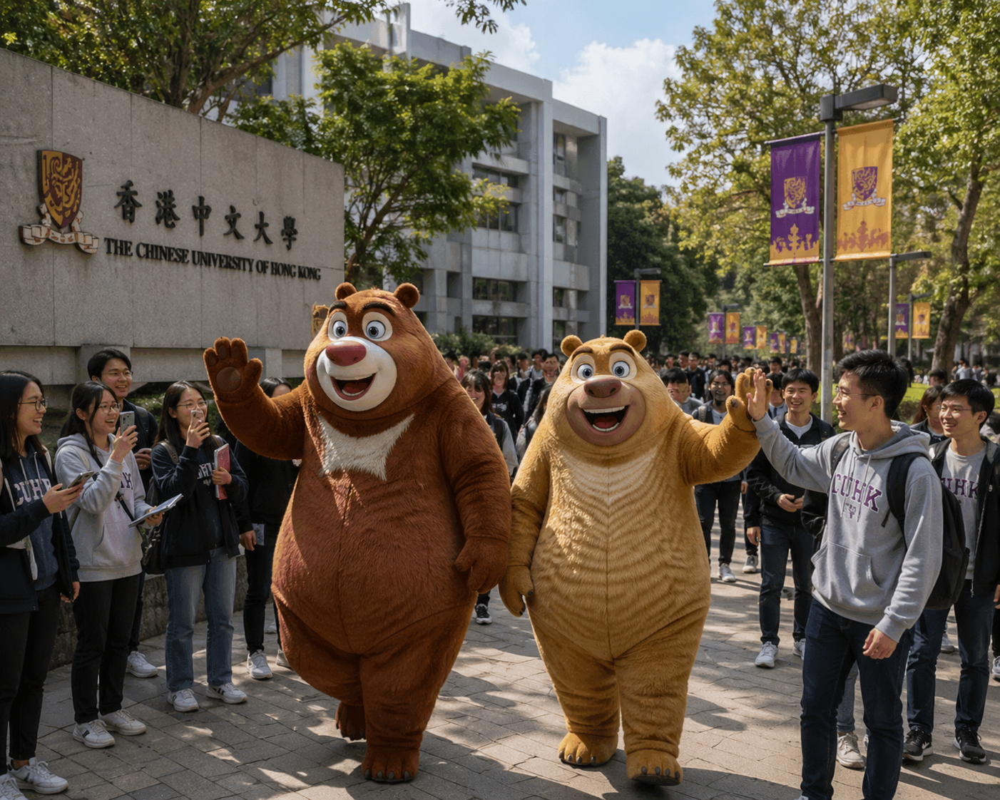
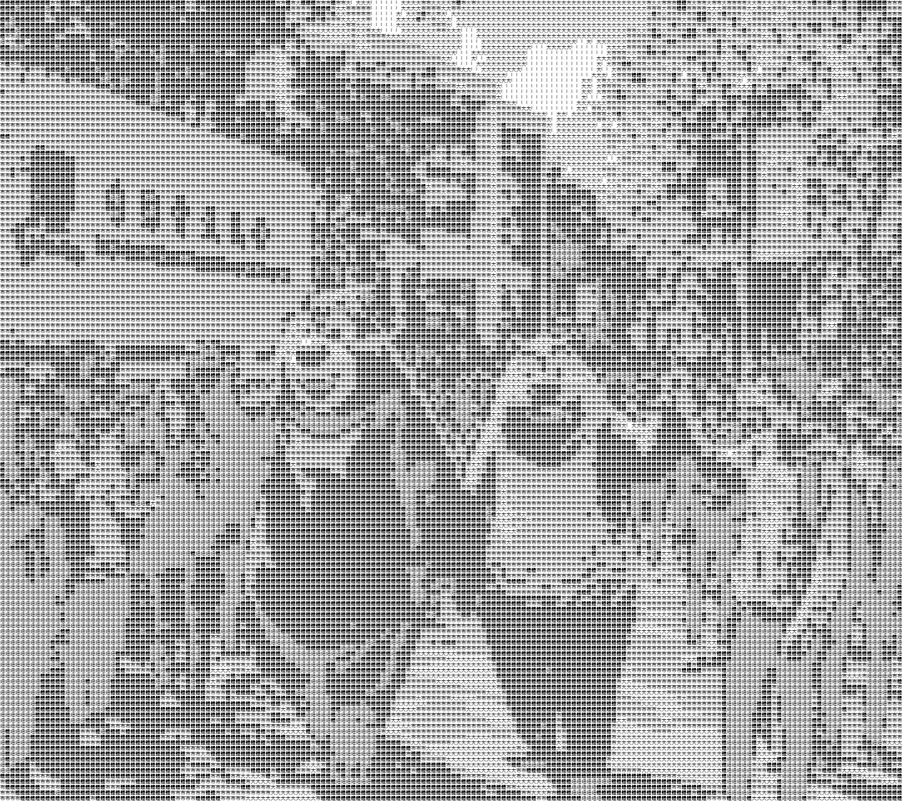

# TextPictures

TextPictures turns an input image into a high-resolution Chinese-character density mosaic.
Viewed up close, the output is made from many small repeated characters. Viewed from a distance, the original image shape appears through the character density. The project can run as a static GitHub Pages website or as a local command-line script.

## Example

| Input image | TextPictures output |
| --- | --- |
|  |  |

## Requirements

The command-line Python version uses `uv` for dependency management.

```bash
uv sync
```

## Website Usage

The website is `index.html`. It runs completely in the browser, so GitHub Pages can host it without a Python server. Users upload one JPG, PNG, BMP, or WEBP image, preview the generated result, and download PNG outputs.

To test the website locally with a simple static server:

```bash
python3 -m http.server 8000
```

Then open:

```text
http://127.0.0.1:8000
```

The website provides download buttons for:

- `textpicture_detail.png`: the detailed Chinese-character mosaic.
- `textpicture_blur.png`: a blurred far-view preview.
- `textpicture_compare.png`: a side-by-side comparison with the original image, detailed mosaic, and blurred preview.

To deploy with GitHub Pages, set the Pages source to the repository root, or copy `index.html` to the branch or folder used by your Pages site.

Safari may ask for download permission the first time a generated PNG is saved. If `index.html` is opened directly as a local `file://` page, Safari can show a blank website name in that permission dialog. When the page is served from GitHub Pages or a local HTTP server, Safari uses the actual site address instead.

## Command-Line Usage

Place an image named `input.jpg` or `input.png` in this directory, then run:

```bash
uv run python textpictures.py
```

The script checks `input.jpg` first, then `input.png`. If neither file exists, it logs `input.jpg does not exist` and exits without generating output images.

## Command-Line Outputs

Running the script generates:

- `output_detail.png`: the detailed high-resolution text mosaic.
- `output_blur.png`: a Gaussian-blurred preview that simulates viewing the mosaic from far away.
- `output_compare.png`: a side-by-side comparison with the original image on the left, the detailed mosaic in the middle, and the blurred preview on the right.

For very large input images, `output_detail.png` keeps the full high-resolution scale, while `output_blur.png` and `output_compare.png` are generated as resized preview images to avoid impractically large files.

## How It Works

Both the static website and the Python script treat the image as a grid of text cells rather than drawing normal pixels. The website uses JavaScript Canvas so it can run on GitHub Pages without a backend. The Python script reads `input.jpg` or `input.png` and uses the Pillow/OpenCV pipeline in `textpictures.py`.

In the Python version, the input image is divided into `15x15` pixel blocks. For each block, the program **calculates the average brightness from the HSV value channel instead of plain grayscale**. This is important because saturated colors such as red can look dark in grayscale even when they should behave like a bright background. The browser version follows the same visual idea with Canvas image data and uses the maximum RGB channel as a static-site-friendly brightness approximation.

Each source block becomes one `30x30` output cell:

- The main image area uses eight brightness tiers: `IIII`, `港`, `香`, `牛`, `学`, `中`, `文`, and `大`, from darkest to brightest.
- The darkest tier uses bold repeated `I` letters so the cell has enough black ink to read as a true shadow. The remaining tiers are ordered by measured visual ink density, so dense bold characters represent darker tones and simpler regular characters represent lighter tones.
- The exact brightness thresholds are calculated from the current input image using adaptive quantiles. This makes the available character tiers spread across the actual photo instead of relying on fixed values that may be too dark or too bright for a particular image.
- The leftmost and rightmost output columns do not sample the image. Instead, they write `富强民主文明和谐自由平等公正法治爱国敬业诚信友善` from top to bottom, repeating when the image is taller than the phrase.

All cells use the same `27px` font size. This size was chosen to fill most of each `30x30` cell while still leaving enough margin to prevent neighboring characters from touching or overlapping. The tonal tiering is therefore based on glyph shape, boldness, and adaptive thresholding rather than font-size changes. Because every output cell is a real character on a white background, the result is readable up close as a text grid. From farther away, the gradual shift across the eight tiers gives the silhouette more tonal detail and a livelier contour. The script also creates a Gaussian-blurred preview with OpenCV to simulate this far-view effect, then combines the original image, the detailed text mosaic, and the blurred preview into one comparison image.

## Git Pull And Push Guide

Before pulling from the `prototype` branch, configure Git to use merge commits instead of rebasing:

```bash
git config pull.rebase false
git pull origin prototype
```

If there is a conflict like this:

```text
CONFLICT (modify/delete): .DS_Store deleted in f1aa7bd08f607f3780ac40bfb87030282b119054 and modified in HEAD.  Version HEAD of .DS_Store left in tree.
Automatic merge failed; fix conflicts and then commit the result.
```

Resolve the `.DS_Store` index conflict with:

```bash
git rm --cached .DS_Store
```

Then make another commit and push to `prototype`:

```bash
git add .DS_Store
git commit -m "third commit"
git push origin prototype
```
